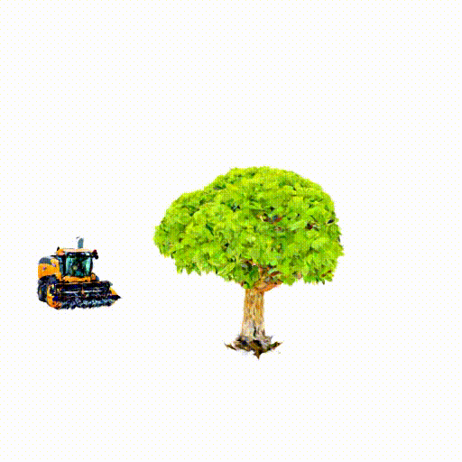
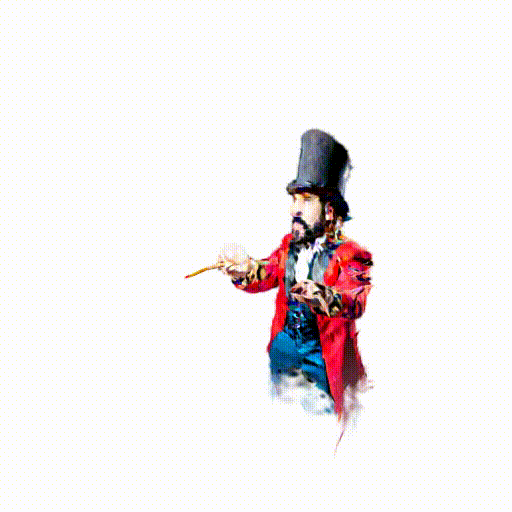
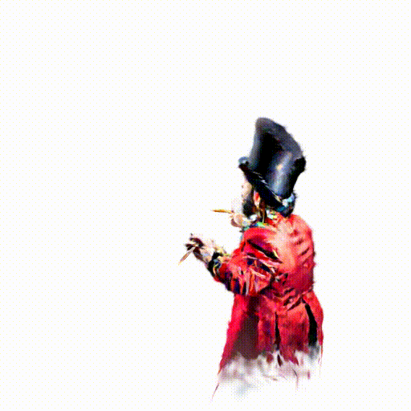
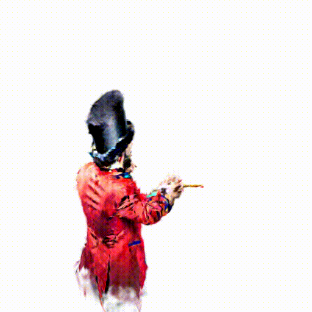

# Trans4D: Realistic Geometry-Aware Transition for Compositional Text-to-4D Synthesis

<p align="left">
  <a href='https://arxiv.org/abs/2410.07155'>
  </a> 
</p>

<p align="center">
   
<br/>
   
<br/>
   
</p>

<details>
    <summary>Click for full abstract</summary>
Recent advances in diffusion models have demonstrated exceptional capabilities in image and video generation, further improving the effectiveness of 4D synthesis. Existing 4D generation methods can generate high-quality 4D objects or scenes based on user-friendly conditions, benefiting the gaming and video industries. However, these methods struggle to synthesize significant object deformation of complex 4D transitions and interactions within scenes. To address this challenge, we propose Trans4D, a novel text-to-4D synthesis framework that enables realistic complex scene transitions. Specifically, we first use multi-modal large language models (MLLMs) to produce a physic-aware scene description for 4D scene initialization and effective transition timing planning. Then we propose a geometry-aware 4D transition network to realize a complex scene-level 4D transition based on the plan, which involves expressive geometrical object deformation. Extensive experiments demonstrate that Trans4D consistently outperforms existing state-of-the-art methods in generating 4D scenes with accurate and high-quality transitions, validating its effectiveness.
</details>


## Install

- Download `./load/` from [threestudio](https://github.com/threestudio-project/threestudio)

- Install `PyTorch`. We have tested on `torch2.0.0+cu118`, but other versions should also work fine.

```sh
# torch2.0.0+cu118
pip install torch==2.3.0 torchvision --index-url https://download.pytorch.org/whl/cu118
```

- (Optional, Recommended) Install ninja to speed up the compilation of CUDA extensions:

```sh
pip install ninja
```

- Install dependencies:

```sh
pip install -r requirements.txt
pip3 install -U xformers --index-url https://download.pytorch.org/whl/cu118
```

- MVDream multi-view diffusion model is provided in a different codebase. Install it by:

```sh
git clone https://github.com/bytedance/MVDream extern/MVDream
pip install -e extern/MVDream 
```

- Install 3DGS

```bash
# 3D Gaussian Splatting modules, skip if you already installed them
# a modified gaussian splatting (+ depth, alpha rendering)
git clone --recursive https://github.com/ashawkey/diff-gaussian-rasterization
pip install ./diff-gaussian-rasterization
pip install ./simple-knn
```

## Inference

- The basic version of Physics-aware 4D Transition Planning can be found in the path `./4d-Agent/`. The full reasoning code will be released when this work is accepted. Besides, we provide the 4D data in the path `./arguments/`.
- The training and rendering scripts can be referred to the file `./full_training_pipeline.sh`. We have also provided pre-generated coarse 3D objects in `./input_ply/` for a quick test of our Trans4D, in case you prefer not to generate the coarse 3D objects using [threestudio](https://github.com/threestudio-project/threestudio)

## Citation
```
@article{zeng2024trans4d,
  title={Trans4D: Realistic Geometry-Aware Transition for Compositional Text-to-4D Synthesis},
  author={Zeng, Bohan and Yang, Ling and Li, Siyu and Liu, Jiaming and Zhang, Zixiang and  Tian, Juanxi and Zhu, Kaixin and Guo, Yongzhen and Wang, Fu-Yun and Xu, Minkai and Ermon, Stefano and Zhang, Wentao},
  journal={arXiv preprint arXiv:2410.07155},
  year={2024}
}
```
